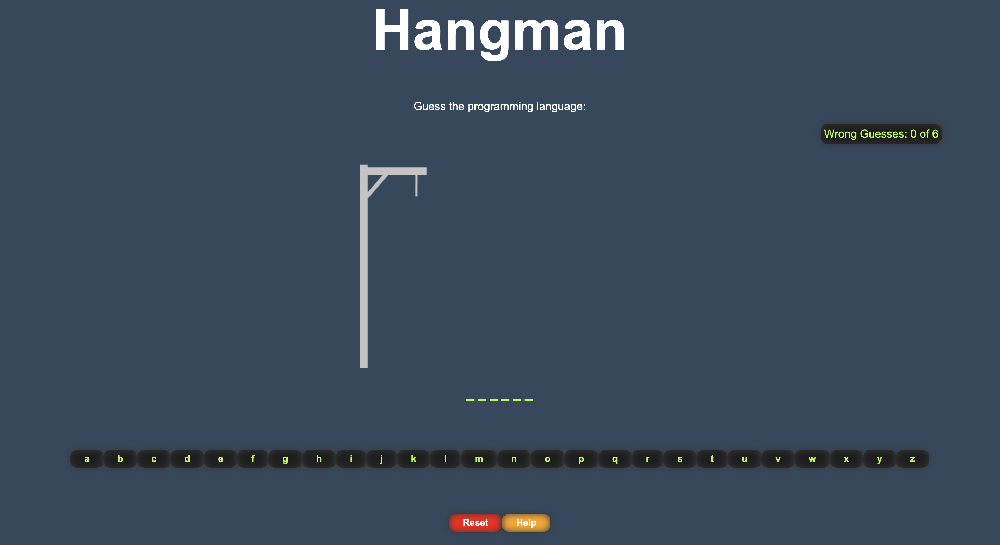
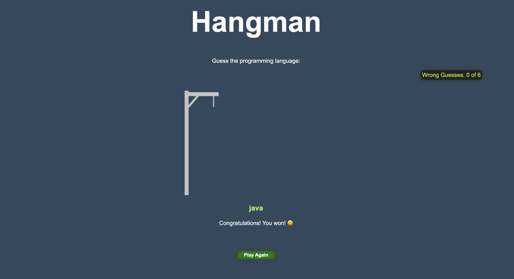

<p align="center">
  
  
</p>

# Rules of the Hangman: 

1.The game chooses a secret word.

2.The player guesses letters to try to figure out the secret word.

3.If the player guesses a letter that is in the secret word, the letter is revealed in the word.

4.If the player guesses a letter that is not in the secret word, a part of the hangman is drawn.

5.If the player makes six incorrect guesses, the game is over and the player loses.

6.If the Player correctly guesses all the letters in the secret word, the game is over and the player wins.


<h1 align="center">Hangman Game 🥳</h1>
<h2 align="center">A clean, beautiful, responsive and 100% customizable Game.</h2>

- Made with React
- Styled with CSS
- Code style Prettier

# Components 📚
✔️ Hangman.js\
✔️ Helper.js\
✔️ Words.js\
✔️ Popup.js\

# Clone And Use 📋

- The website is completely built on `react-js` library of `javascript` that's why we need `node.js` and `npm` installed.
- In case you want to help developing it or simply saving it, you can fork the repository just by clicking the button on the top right corner on this page.
- Clone the repository into your local system using bellow command:
 - ```python
    git clone https://github.com/OleksandrAndronyak/hangman
   ```
- This will clone the whole repository into your system.
- To download required dependencies to your system and run the application at the same time navigate to the directory where the cloned repository resides and execute the following command:
 - ```python
    npm start
   ```
- The project will download all dependencies and run by itself opening locally the website in your browser.

### changing Game Words
- Go to into `src/components/Words.js` there you can change all the words for the game and as much you desire.
``` python
// Words Data
const words = [
"python",
"javascript",
 ...
];

 ...
```